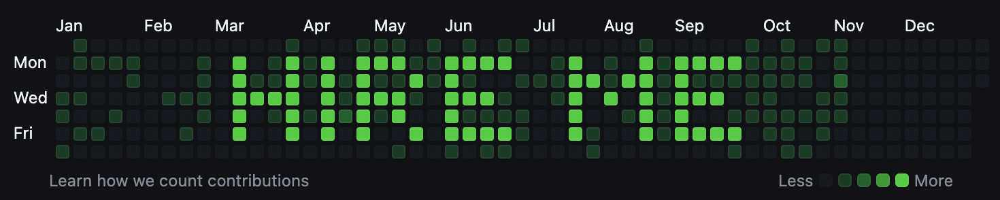
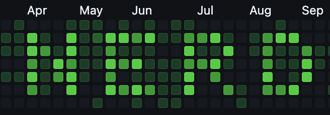

# Nerd Commit

Have a stupid word on your github graph





> [!CAUTION]
> This is a dumb project and you are stupid for using it! but feel free to do so

### Setup

##### Setting up the commit repo

Create the directory where you will store the commits, name it `empty-repo-nerd-commit-$YEAR` where YEAR is the year graph you wanna commit to
init the repo and create your remote.

```bash
mkdir empty-repo-nerd-commit-2024

cd empty-repo-nerd-commit-2024

git init

gh repo create # using github CLI

```

After it you can clone this project and run the `setup.sh` file.

```bash
git clone https://github.com/GMkonan/nerd-commit.git

sh ./setup.sh
```

Now you can go to `localhost:5173` and use the UI to customize your graph!

(UI image here)

### Todo

- styling web ui

### Ideas

- have a way to write something and this be transformed into pixel art writing in the middle of the graph
- drawing by moving mouse and not only clicking
- make blocks more consistent in color
  - probably when we do an X amount of commits in a certain date that already has a couple commits it makes it differ between
  - blocks that are part of the drawing/writing the user specificed.
