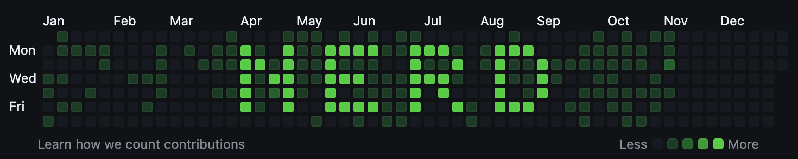

# Nerd Commit
Have a stupid word on your github graph, You can run the web and server to create your own word! Better instructions will be written at some point...




> [!CAUTION]
> This is a dumb project and you are stupid for using it! but feel free to do so


### How do I do it?
Create a repo that will store the commits. This simple script works by committing empty on certain dates specified.
Now you can point the repo name as an argument to the shell file.

```bash
chmod +x ./setup.sh 

./setup.sh ../relative/path/to/dummy/repo # defaults to ../empty-repo-nerd-commit/
```

### Todo
- styling web
- year dropdown
- pass year info to script via server
- install script (initiate web and server and guide user)
- new readme


#### Ideas
- Setup readme on empty commit repo to specify that it's indeed, a nerd commit empty repo
- drawing by moving mouse and not only clicking
